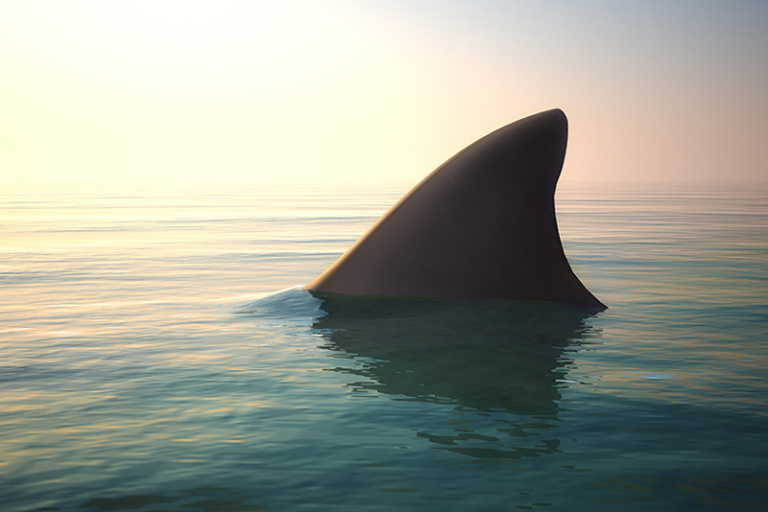
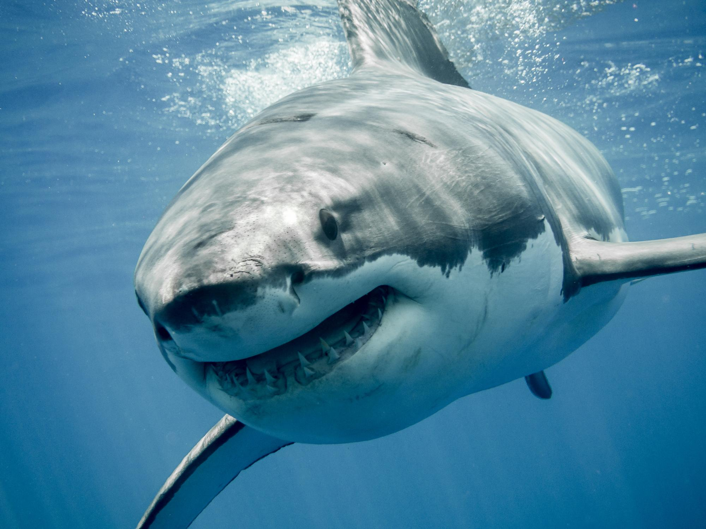

# PANDAS PROJECT - SHARK ATTACK

### Data cleaning & vusualization

The aim of this project is to understand the dataset that have being given tu us ["Global Shark attacks"](https://www.kaggle.com/teajay/global-shark-attacks) in order to be able to suggest a good hipotesis that I will study and make it visual. To achive all this I will follow nexts steps:
>1. **Expore the data**. What tipe of datas and variavles do I have?
>2. **Present an hypothesis**  What do we whant to support whith our info ?
>3. **Clean the data**. which are the usefull datas to find and support my hypothesis?
>4. **Analyze the data**. In order to practice what we have learns in class, whith a focuss on pandas.
>5. **Make it visual**. For me and for others to de understable

### Exproring data
The initial analysis starts from a very dirty Dataframe, with a shape (25723, 24), in which each of its columns contains at least 66% null data.
>- The variable countries seems interesting, it is not one of the most null and can provide interesting information, it will be the starting point. 
>- In addition, another interesting information is that al first all the variables looks like they are categorical, so we will have to base ourselves on the relationship between them without being able to delve into their correlations.

### Hypothesis
TOP3 shark attack countries in the past 40 years. Which are them and which species predominates?

### Cleaning and analyzing
I have follow 3 steps in order to clean and found the important imformation:
>-  1. Look for the TOP 3 Countries with more cases
>-  2. Look for our new and cleaner dataframe, focus on attacks by countries and years.
>-  3. Cross my information by continent whith the species of sharks.
And finally get a dataframe with 2016 rows × 3 columns, readu to be visual.

### Visualization and conclusions

So after observing this graphs we can conclude that there are one common specie that is the most dangerous in our TOP3 countries. The White Shark.

**If you want further information of muy project, please visit it!**

### Aditional information

I have use the following libraries:
>- import numpy as np
>- import pandas as pd
>- import re
>- import seaborn as sns
>- import src.clean_utils as cu
>- import matplotlib.pyplot as plt

